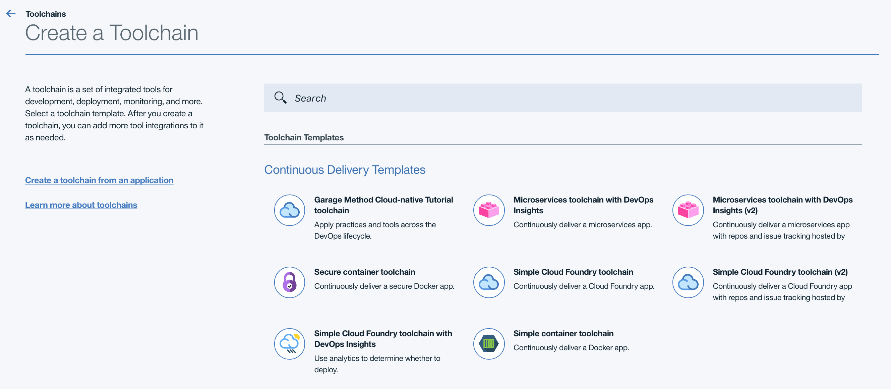
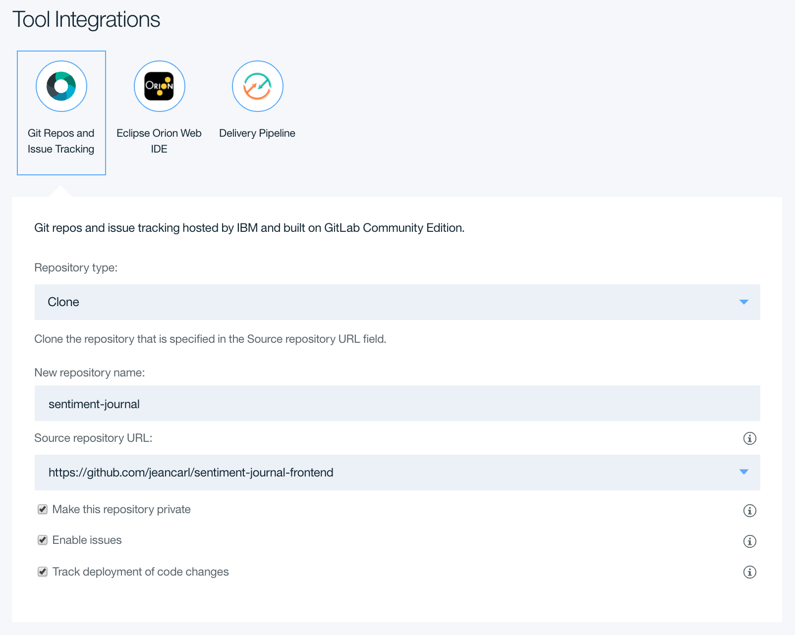
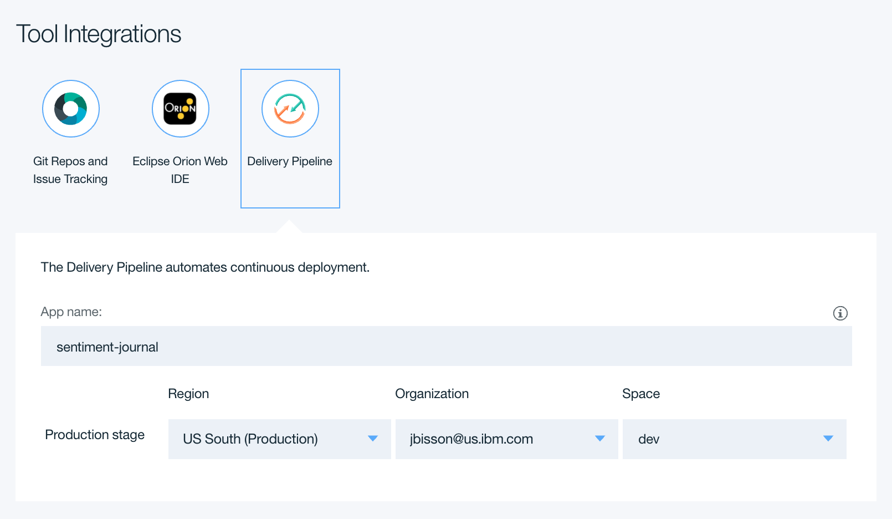
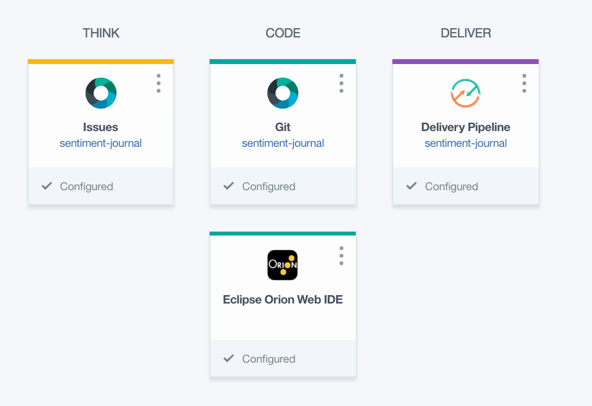
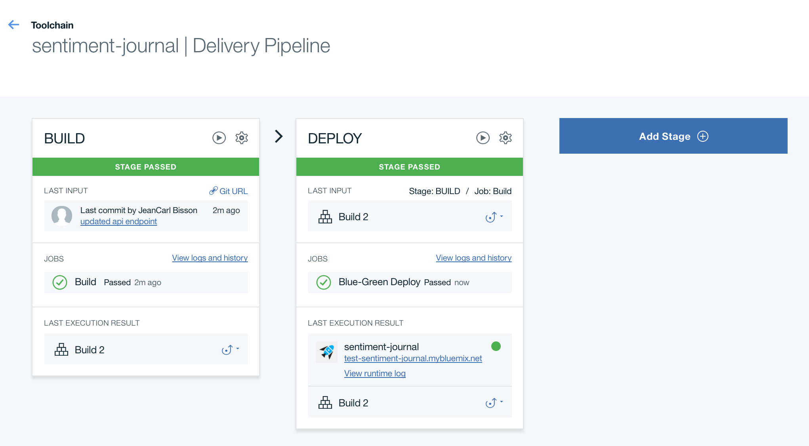

# Sentiment Journal Angular Application

This repo contains an Angular 2 application that uses a [backend server API](http://github.com/jeancarl/sentiment-journal-backend) to analyze sentiment of journal entries.

## Pre-requistes

* Install Angular CLI:

	```
	npm install -g angular-cli
	```
* Deploy the backend Node.js application (either locally or in IBM Bluemix)

## Getting Started

There are three ways to run this application:

* Running Locally - run the Angular application via the Angular CLI tool
* Deploy To IBM Bluemix via Continuous Delivery Toolchain - create a Continuous Delivery pipeline that deploys changes from a Git Repo to the IBM Bluemix platform
* Deploy To IBM Bluemix via Cloud Foundry CLI - manually deploy the Angular application to the IBM Bluemix platform.

## Run Locally

1. Clone this repo and change into the root directory.

	```
	git clone http://github.com/jeancarl/sentiment-journal-frontend
	cd sentiment-journal-frontend
	```

1. Edit the `items.service.ts` file in the `app` directory. Change the `API_ENDPOINT` value to point to the backend server API that stores and analyzes the journal entries.

	```
	...
	@Injectable()
	export class ItemsService {
	    private API_ENDPOINT = 'http://<host>.mybluemix.net/api/items'
	
	    constructor(private http: Http) { 
	    
	    }
	...
	```

1. Install the NPM dependencies:

	``` 
	npm install
	```

1. Serve the application locally via the Angular CLI:


	```
	ng serve
	```

1. Access the application via the localhost URL (i.e. `http://localhost:4200`) given in the response to this command.
	
1. Alternatively, instead of running `ng serve`, run `ng build` and then open `dist/index.html` in the browser. This will use the bundled version of the application.

## Deploy To IBM Bluemix via Continuous Delivery Toolchain

In this section, we'll use the Continuous Delivery Toolchain to create a Git repo and deploy the Angular application code to a static Cloud Foundy buildpack on IBM Bluemix platform.

1. Create a `Simple Cloud Foundry toolchain (v2)` via the Continuous Delivery service found under the DevOps category of the IBM Bluemix catalog. 

	

1. Click on the `Git Repos and Issue Tracking` icon. Clone this repo (https://github.com/jeancarl/sentiment-journal-frontend) into a new repository named `sentiment-journal`. This will create a new Git repo in your account with the contents of the project.

	

1. Click on the `Delivery Pipeline` icon. Choose an app name and the region, organization, space you want to deploy this application. Click Create.

	
	
1. On the next screen, you will see the different components of the toolchain. Click `Git` tile under `Code` to access the project's Git repo.

	
	
1. Under the title and description of the project, copy the Git repo URL. Clone the Git repo locally:

	```
	git clone GIT_URL
	```

1. Edit the `items.service.ts` file in the `src/app` directory. Change the `API_ENDPOINT` value to point to the backend server API that stores and analyzes the journal entries.

	```
	...
	@Injectable()
	export class ItemsService {
	    private API_ENDPOINT = 'http://<host>.mybluemix.net/api/items'
	
	    constructor(private http: Http) { 
	    
	    }
	...
	```

1. Install the NPM dependencies:

	``` 
	npm install
	```

1. Build the Angular 2 application (this will package up the application into the `dist` folder.

	```
	ng build
	```
	
1. Check for any modified files (i.e. items.service.ts and dist folders). Add them to the commit:

	```
	git status
	git add src/app/items.service.ts
	git add dist
	```

1. Commit and push the changes.

	```
	git commit -m "commit message"
	git push origin master
	```
	
1. Return to the toolchain and click on the Delivery Pipeline tile. Each time changes are pushed to this Git repo, the Delivery Pipeline will build and deploy the changes to the IBM Bluemix application.

1. When both stages have passed, click on the mybluemix.net URL under the Last Execution Result. This will launch a new browser tab with the static website.

	

## Deploy To IBM Bluemix via Cloud Foundry CLI

This application can also be pushed via the Cloud Foundry CLI. Ensure you have the Cloud Foundry CLI tool installed locally.

1. Clone this repo and change into the root directory.

	```
	git clone http://github.com/jeancarl/sentiment-journal-frontend
	cd sentiment-journal-frontend
	```

1. Edit the `items.service.ts` file in the `app` directory. Change the `API_ENDPOINT` value to point to the backend server API that stores and analyzes the journal entries.

	```
	...
	@Injectable()
	export class ItemsService {
	    private API_ENDPOINT = 'http://<host>.mybluemix.net/api/items'
	
	    constructor(private http: Http) { 
	    
	    }
	...
	```

1. Build the application. This will generate a folder named `dist` with the packaged Angular application.

	``` 
	ng build
	```

1. Create/modify the `manifest.yml` file in the root directory of the Angular application:

	```
	applications:
	- name: sentiment-journal
	  buildpack: staticfile_buildpack
	  host: sentiment-journal
	  domain: mybluemix.net
	  memory: 32M
	  path: dist
	```
	Change the name and host properties.
	
	| Property | Description |
	|----|-----------|
	| name | convenient name for the Bluemix application | 
	| host | host name where the application will be accessible (i.e. `http://<host value>.mybluemix.net`) |

1. Deploy the application to IBM Bluemix by running the Cloud Foundry push command (if this is your first time using the `cf` command, you will need to `cf login` to authenticate.

	```
	cf push
	```

1. Access the application via the `<host>.mybluemix.net` URL given in the log.